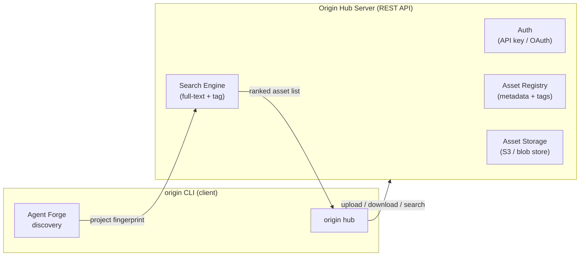

# Origin Hub — Central Asset Registry

## Overview

A central server and CLI integration that lets users **publish**, **discover**, **download**, and **auto-install** Agent Forge assets (skills, agents, instructions, workflows) — similar to npm for Node or PyPI for Python, but purpose-built for AI workspace assets.

Auto-selection works by running Agent Forge's project discovery scan and using the results to query the Hub for the best-matching assets, then offering to install them in one step.

---

## Architecture



---

## Asset Types

| Type | Source in project | File pattern |
|------|-------------------|--------------|
| **Skill** | `.github/prompts/` or `.copilot/agents/` | `*.agent.md` |
| **Instruction** | `.github/instructions/` | `*.instructions.md` |
| **Prompt** | `.github/prompts/` | `*.prompt.md` |
| **Workflow** | `.specify/templates/` | `*.prompt.md` (presets) |
| **Extension** | `.origin/extensions/<name>/` | `origin-extension.yaml` + assets |

---

## New CLI Command Group: `origin hub`

```
origin hub login              # Authenticate with the Hub (stores API key)
origin hub publish <path>     # Package and upload an asset or extension
origin hub search <query>     # Search the Hub for assets by keyword / tag
origin hub install <name>     # Download and install a specific asset by name[@version]
origin hub discover           # Run Agent Forge scan → auto-recommend + install assets
origin hub whoami             # Show current authenticated user
origin hub logout             # Remove stored credentials
```

---

## Proposed Changes

---

### New module — `origin_cli/hub/` [NEW]

#### [NEW] `origin_cli/hub/__init__.py`
Empty package marker.

#### [NEW] `origin_cli/hub/client.py`
HTTP client wrapper around the Hub REST API. Uses only the stdlib `urllib` (no extra deps) or optionally `httpx`/`requests` if added as a dependency.

Responsibilities:
- `HubClient(base_url, api_key)` class
- `client.publish(asset_bundle_path)` → `POST /assets`
- `client.search(query, asset_type, tags, limit)` → `GET /assets?q=...`
- `client.download(name, version)` → `GET /assets/{name}/{version}/bundle`
- `client.whoami()` → `GET /auth/me`
- Raises `HubAuthError`, `HubNotFoundError`, `HubServerError` with clear messages.

#### [NEW] `origin_cli/hub/auth.py`
Credential storage — saves the API key securely in `~/.origin/hub_credentials.json` (mode `0600` on POSIX). Provides `load_credentials()` / `save_credentials()`.

#### [NEW] `origin_cli/hub/packager.py`
Bundles a local asset or extension directory into an **`.originpkg`** archive (a gzipped tar) with a normalized `hub-manifest.json` inside.

`hub-manifest.json` fields:
```json
{
  "name": "forge-frontend-expert",
  "version": "1.0.0",
  "type": "skill | agent | instruction | workflow | extension",
  "description": "...",
  "tags": ["frontend", "react", "typescript"],
  "author": "pandaind",
  "origin_cli_min_version": "0.1.0",
  "files": ["forge-frontend-expert.agent.md"]
}
```

#### [NEW] `origin_cli/hub/discovery.py`
Runs Agent Forge project discovery (`forge init --mode analyze --dry-run` or reads existing `.forge/` output) and extracts a **project fingerprint** — a set of detected technologies, languages, and frameworks. This fingerprint is sent to `GET /assets/recommend?tech=react,typescript,...` to get ranked asset suggestions.

#### [NEW] `origin_cli/hub/installer.py`
Downloads an `.originpkg` bundle, unpacks it, and routes it to the correct local installer:
- `skill` / `agent` / `instruction` / `prompt` → copies to the appropriate `.github/` or `.copilot/` path
- `workflow` → delegates to `SpecKitWrapper`
- `extension` → delegates to `InstallationManager`

---

### New command file — `origin_cli/commands/hub.py` [NEW]

Typer sub-app exposing all `origin hub *` sub-commands. Each command is thin: it validates arguments, calls `HubClient`, and pretty-prints results with `rich`.

Key UX details:
- `origin hub search` → displays a rich table: name, type, tags, downloads, author
- `origin hub discover` → shows a spinner while scanning, then an interactive checklist of recommended assets to install
- `origin hub publish` → shows a progress bar during upload

---

### Modified — [`main.py`](file:///Users/cpanda/Projects/origin-cli/origin_cli/main.py)

Register the new `hub` app:
```python
from origin_cli.commands.hub import app as hub_app
app.add_typer(hub_app, name="hub", help="Publish and discover assets on the Origin Hub")
```

---

### Modified — [`pyproject.toml`](file:///Users/cpanda/Projects/origin-cli/pyproject.toml)

Add `httpx` (or `requests`) as a dependency for Hub HTTP calls. `httpx` is preferred as it supports both sync and async and has a clean API:
```toml
"httpx>=0.27.0",
```

---

## Server API Contract (for reference / future server implementation)

| Method | Path | Description |
|--------|------|-------------|
| `POST` | `/auth/token` | Exchange credentials for API key |
| `GET` | `/auth/me` | Get current user info |
| `POST` | `/assets` | Upload a `.originpkg` bundle (multipart) |
| `GET` | `/assets` | Search assets (`?q=&type=&tags=&limit=`) |
| `GET` | `/assets/{name}` | Get asset metadata |
| `GET` | `/assets/{name}/{version}/bundle` | Download `.originpkg` |
| `DELETE` | `/assets/{name}/{version}` | Yank a version |
| `GET` | `/assets/recommend` | Get assets by tech fingerprint (`?tech=react,ts`) |

---

## Auto-Select Flow (`origin hub discover`)

```
1. Run: forge init --mode analyze  (or read existing .forge/ output)
2. Extract project fingerprint: { "tech": ["react", "typescript", "jest"] }
3. Call: GET /assets/recommend?tech=react,typescript,jest
4. Display interactive checklist of top-N recommended assets
5. User selects → origin hub install each selected asset
6. Print summary of what was installed
```

---

## Open Questions

> [!IMPORTANT]
> **Where will the Hub server be hosted?** This determines the `DEFAULT_HUB_URL` baked into the CLI. Options:
> - A cloud service you control (e.g., `https://hub.originai.dev`)
> - Self-hosted (user provides `--hub-url`)
> - GitHub as a registry backend (assets stored in a GitHub repo, API backed by GitHub API)

> [!IMPORTANT]
> **Authentication model**: API key (simple) vs OAuth via GitHub (social login, ties assets to GitHub identity)?

> [!NOTE]
> **Asset versioning**: Should the Hub enforce semver? Or allow any string? Recommend semver with a `latest` alias.

> [!NOTE]
> **Visibility**: Should assets be public-by-default or private-by-default? Should teams be able to run a private Hub?

---

## Implementation Phases

| Phase | Scope |
|-------|-------|
| **Phase 1** | `hub/client.py`, `hub/auth.py`, `hub/packager.py`, `login`, `publish`, `search`, `install` commands |
| **Phase 2** | `hub/discovery.py`, `discover` command + Agent Forge integration |
| **Phase 3** | Server implementation (separate repo), public Hub deployment |

---

## Verification Plan

### Automated Tests
- Unit tests for `packager.py` (bundle/unbundle round-trip)
- Unit tests for `client.py` (mocked HTTP responses)
- Unit tests for `auth.py` (credential load/save)
- `pytest tests/` — all existing tests must still pass

### Manual Verification
1. `origin hub login` → stores credentials
2. `origin hub publish ./my-extension/` → creates `.originpkg`, uploads, prints asset URL
3. `origin hub search "frontend"` → shows table of results
4. `origin hub install forge-frontend-expert` → downloads and installs asset
5. `origin hub discover` → scans project, shows recommendations, installs selected
